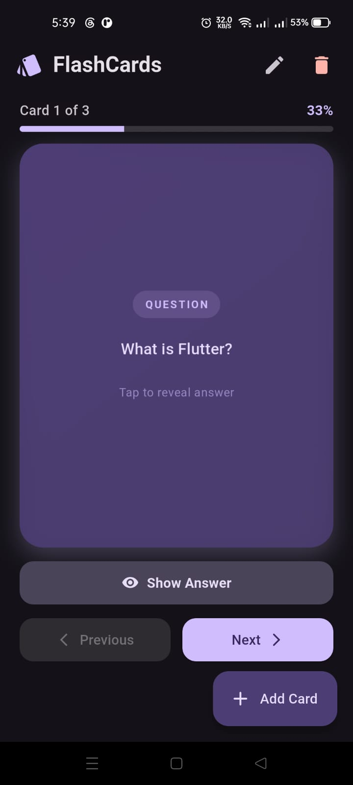
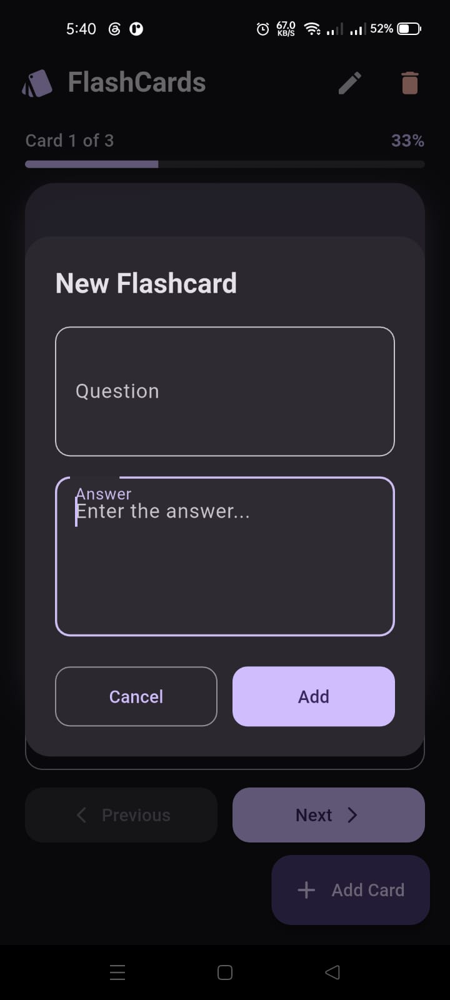
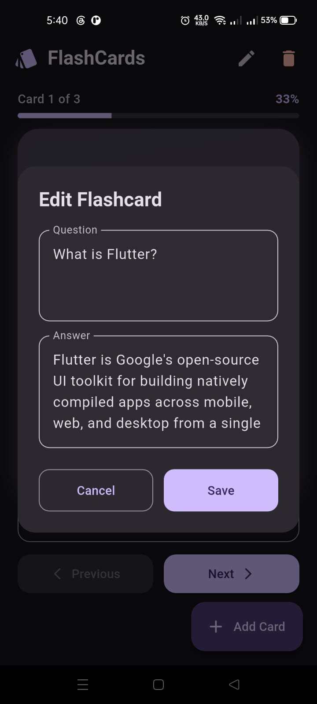
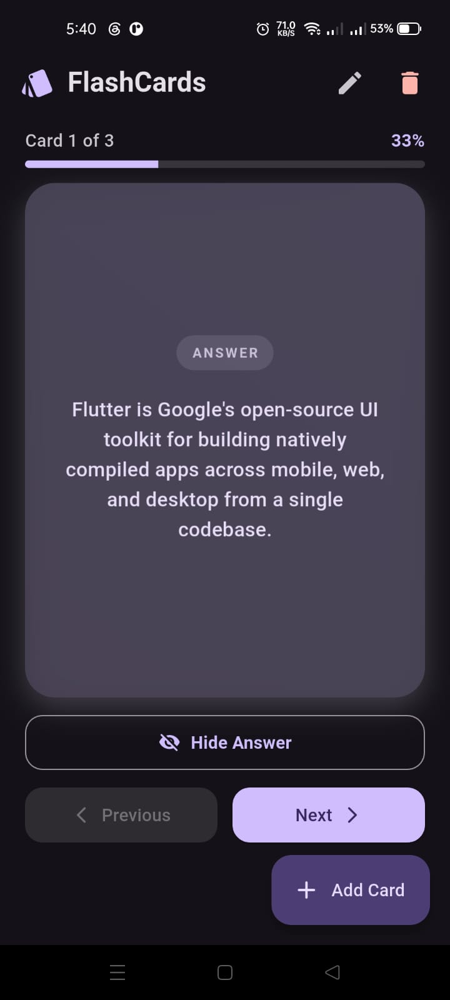

📚 Flashcard Quiz App

A simple and interactive Flashcard Quiz App built to help users learn and memorize information in an easy and fun way.

🚀 Features
➕ Add custom flashcards (Question / Answer)
🔄 Flip cards to reveal answers
🧠 Quiz mode to test knowledge
📊 Score tracking (if implemented)
💾 Local data storage (if used)
🎨 Clean and responsive UI
🛠️ Built With
Flutter
Dart
Material Design
Provider / SetState
🎯Project Purpose
This project was created to practice Flutter development skills including:
UI building with widgets
State management
User interaction handling
Local data storage
Building real-world small apps
## 📸 Screenshots

### 🏠 Home Screen

### ➕ Add Card Screen

### ✏️ Edit Card Screen

### 👁️ View Answer Screen

🚀 Future Improvements
Add categories for flashcards
Add spaced repetition system
Improve animations (card flip animation)
Cloud sync support
Dark mode
👩‍💻 Developer

Kholod Ali
Front-End & Flutter Developer
